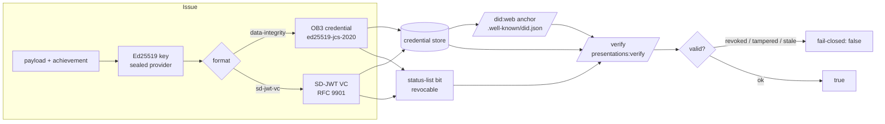

# mneurix-did-issuer

A self-hostable **did:web + W3C Verifiable Credentials** issuance + verification
engine — multi-cloud-resilient, key-custody-first, no phone-home. The trust
engine of [Mneurix](https://github.com/akketix) Sovereign Credential
Infrastructure: you run it on your own servers, you hold the keys, you mint
un-forgeable credentials.

[](https://github.com/akketix/mneurix-did-issuer/actions/workflows/ci.yml)
[](./LICENSE)
<!-- conformance badges land in P2: W3C VC v2 · SD-JWT (RFC 9901) · did:web · OB3 -->

> **Status:** live (not a scaffold). did:web DID documents, OB3 (data-integrity,
> ed25519-jcs-2020) + SD-JWT VC (RFC 9901) issuance, bitstring status-list
> revocation, multi-origin DID publish + quorum resolution, sealed-key custody
> with a prod boot guard, and an air-gap-verifiable license framework are all
> implemented and tested.

---

## Evaluate in 2 minutes

```bash
git clone https://github.com/akketix/mneurix-did-issuer && cd mneurix-did-issuer
docker build -t did-issuer .
# Set a service token (the service refuses the default in production — see the
# boot guard in src/index.ts). Bind loopback only for a local eval.
TOKEN=change-me-$(openssl rand -hex 12)
docker run -p 127.0.0.1:7004:7004 -e MNEURIX_DID_ISSUER_SERVICE_TOKEN=$TOKEN did-issuer
# in another shell — mint a verifiable credential:
curl -s localhost:7004/health                       # -> {"status":"ok",...}
curl -s localhost:7004/.well-known/did.json | head   # -> the did:web DID document
curl -s -X POST localhost:7004/v1/vcs:issue \
  -H "x-mneurix-service-token: $TOKEN" -H "content-type: application/json" \
  -d '{"secure":"data-integrity","subjectId":"did:web:example.com:alice","achievement":{"id":"a1","name":"Demo"}}'
```

No network egress, no telemetry, no account. The keys are generated + sealed on
first boot under `data/keys/`.

## What it does



- **did:web** DID documents (`/.well-known/did.json`), multi-origin publish +
  **quorum** resolution (`POST /dids/:did/publish`, `GET /dids/:did`) — atomic
  2-phase publish, rotate/revoke with tombstoning.
- **OB3** credentials (data-integrity, `ed25519-jcs-2020`) + **SD-JWT VC**
  (RFC 9901) via `POST /v1/vcs:issue` (`secure: data-integrity | sd-jwt-vc`).
- **Bitstring status-list revocation**, fail-closed (`GET /credentials/:id/status`).
- **Verify** any issued credential: `POST /presentations:verify` — rejects
  tampered, revoked, or stale-status-list credentials.
- **Key custody:** sealed-key provider (no plaintext at rest in prod), Shamir
  splitting, boot guard that refuses plaintext keys in production, per-install
  DEK salt. Keys never leave your infrastructure.
- **License framework:** Ed25519-signed `PlatformLicense`, **air-gap / no-network
  verify**, warn-on-expiry (degrades, never hard-stops, no phone-home).

## API

| Method | Path | Purpose |
|---|---|---|
| GET | `/health` | liveness |
| GET | `/v1/openapi.json` | full OpenAPI spec |
| GET | `/.well-known/did.json` | did:web DID document |
| GET | `/.well-known/jwt-vc-issuer` | SD-JWT VC issuer metadata |
| POST | `/dids` | create a did:web DID |
| GET | `/dids/:did` | resolve (multi-origin + quorum) |
| POST | `/dids/:did/publish` | atomic multi-origin publish |
| POST | `/dids/:did/keys:rotate` / `:revoke` | key rotation / revocation |
| POST | `/v1/vcs:issue` | issue an OB3 / SD-JWT VC |
| POST | `/presentations:verify` | verify a credential (fail-closed) |
| GET | `/credentials/:id/status` | revocation status |

**Wallet-facing (OID4VCI issuance + OpenID4VP verification):**

| GET | `/.well-known/openid-credential-issuer` | OID4VCI credential-issuer metadata (dual `vc+sd-jwt`/`dc+sd-jwt` configs) |
| GET | `/.well-known/oauth-authorization-server` | OID4VCI auth-server metadata (both grants, PKCE S256) |
| POST | `/v1/credential-offers` | mint a credential offer (`pre-authorized_code` or `authorization_code`) |
| GET | `/oauth/authorize` | authorization endpoint (wallet-initiated, PKCE; delegated or self-hosted auth) |
| POST | `/oauth/consent` | self-hosted consent submit (form-encoded) |
| GET | `/oauth/callback` | delegated lattice-auth callback (HS256-signed `auth_result`) |
| POST | `/oauth/token` | redeem a code for an access token + `c_nonce` (both grants) |
| POST | `/credentials` | fetch the SD-JWT VC (Bearer + proof-of-possession JWT) |
| POST | `/v1/presentations/request` | generate an OpenID4VP request (DCQL; single + multi-credential) |
| POST | `/openid4vp/response` | OpenID4VP presentation receiver (verify a wallet presentation) |
| GET | `/qr` | wallet-integration test page (mints an offer + renders a QR) |

## Wallets (OID4VCI issuance + OpenID4VP verification)

The engine is wallet-facing: recipients hold credentials in standard digital
wallets (AltMe, Talao, EUDI/walt.id) and present them to verifiers. Two flows:

### OID4VCI — issuance into a wallet

Two grants, both producing an SD-JWT VC at `POST /credentials`:

- **Pre-authorized-code** (operator-initiated): `POST /v1/credential-offers`
  mints an offer bound to a pre-known subject; the wallet redeems the
  `pre_authorized_code` at `/oauth/token` for an access token + `c_nonce`, then
  calls `/credentials` with a proof-of-possession JWT (signed by the wallet
  holder key, containing the `c_nonce`).
- **Authorization-code** (wallet-initiated, the flow AltMe + Talao require): the
  wallet redirects the learner to `GET /oauth/authorize` with a PKCE
  `code_challenge`; the learner authenticates; the did-issuer issues a single-use
  authorization code + redirects back to the wallet's `redirect_uri`; the wallet
  redeems the code + PKCE verifier at `/oauth/token`; the wallet obtains the VC
  at `/credentials`.

**Learner authentication in the authorization-code flow** is **delegated**, not
hosted by the did-issuer: when `MNEURIX_LATTICE_AUTH_URL` is set, `/oauth/authorize`
redirects to the lattice's existing auth, which authenticates the learner and
redirects back to `/oauth/callback` with an HS256-signed `auth_result` (shared
secret `MNEURIX_LATTICE_AUTH_SHARED_SECRET`). When unset, the did-issuer renders a
minimal self-hosted consent page (`/oauth/consent`) — the independently-deployable
fallback so the flow completes with only the did-issuer running.

**Wallet compatibility** (discovery): credential-issuer metadata is served at
both `/.well-known/openid-credential-issuer` (current spec path) and the older
`/.well-known/oauth-credential-issuer` alias; both `vc+sd-jwt` and `dc+sd-jwt`
format labels are advertised (two `credential_configurations_supported` entries)
so wallets that key on either accept the credential; `authorization_endpoint` is
advertised in the auth-server metadata. Signing: Ed25519 (EdDSA, did:web) and
ES256 (P-256, x5c) paths are both supported.

**Self-test:** `GET /qr` mints an `authorization_code` offer server-side and
renders a QR encoding `openid-credential-offer://?credential_offer=...` for a
wallet to scan — a self-contained end-to-end wallet test with no service token
exposed to the browser.

### OpenID4VP — verification of a wallet presentation

`POST /v1/presentations/request` generates an OpenID4VP authorization request
(a DCQL query for an SD-JWT VC by `vct`, single or multi-credential) plus a
verifier session (nonce/state). The wallet POSTs the `vp_token` (SD-JWT VC +
KB-JWT) + `state` to `/openid4vp/response` (direct_post); the receiver verifies
the issuer signature, disclosures, holder binding (KB-JWT nonce/aud replay
protection), revocation, and the DCQL query — fail-closed. Supports the
`openid4vp://`, DC API, and redirect transports; unencrypted, JARM, and JWE
encrypted responses; JAR signed requests (x509_hash client-id scheme).

### Cross-issuer verification

The verifier resolves the issuer key from **any** did:web issuer (including a
customer's own credentials), not just this engine's local DID store: a
constrained, SSRF-safe did:web fetch (`MNEURIX_DIDWEB_ALLOW_ORIGINS` allow-list,
private/loopback host blocking, timeout, size cap) fetches the foreign
`/.well-known/did.json`. The local store stays the first attempt (fast, no
network for this engine's own creds).

## License — Elastic License 2.0 (ELv2)

Source is public under [ELv2](./LICENSE). In plain terms, you may **use, copy,
modify, extend, self-host, and build derivative works** — including internal
deployment, with no per-seat limits. You may **not** remove or circumvent
license keys, or **re-host this as a managed/hosted service** for third parties
without a commercial addendum.

**License key requirement**: Evaluation installs run for up to **90 days**. Continued operation in production or self-hosted deployment beyond 90 days requires a cryptographically signed platform license file (`data/license.json`). See [`LICENSING.md`](./LICENSING.md) and [https://mneurix.dev/credential-infrastructure](https://mneurix.dev/credential-infrastructure) for license tiers and purchase details.

## Security posture

- **No phone-home.** License verify, self-meter, and issuance all stay
  local/offline. The license framework degrades, it does not block on network.
- **No DRM, no obfuscation.** IP protection is legal (ELv2 + wordmark) +
  commercial (license-key gating) + lightweight-technical (architectural
  fingerprint, community-build watermark, signed releases) only.
- **Key custody is the security boundary.** Sealed provider, prod boot guard,
  per-install salt, Shamir splitting. See [`docs/compliance.md`](./docs/compliance.md).

## Docs

- [`docs/compliance.md`](./docs/compliance.md) — standards, key custody, env vars
- [`docs/did-method-rubric.md`](./docs/did-method-rubric.md) — did:web method notes
- [`docs/origins-runbook.md`](./docs/origins-runbook.md) — multi-origin + quorum setup
- [`docs/dpa-template.md`](./docs/dpa-template.md) — data-processing template

---

Part of [Mneurix Sovereign Credential Infrastructure](https://mneurix.dev/credential-infrastructure).
Pricing, license keys, and commercial terms: see [mneurix.dev/credential-infrastructure](https://mneurix.dev/credential-infrastructure).