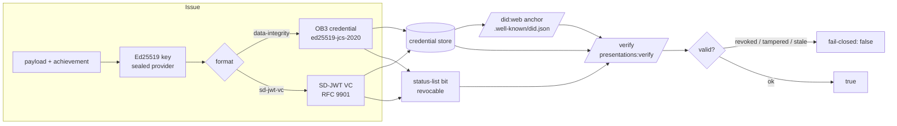

# mneurix-did-issuer

A self-hostable **did:web + W3C Verifiable Credentials** issuance + verification
engine — multi-cloud-resilient, key-custody-first, no phone-home. The trust
engine of [Mneurix](https://github.com/akketix) Sovereign Credential
Infrastructure: you run it on your own servers, you hold the keys, you mint
un-forgeable credentials.

[](https://github.com/akketix/mneurix-did-issuer/actions/workflows/ci.yml)
[](./LICENSE)
<!-- conformance badges land in P2: W3C VC v2 · SD-JWT (RFC 9901) · did:web · OB3 -->

> **Status:** live (not a scaffold). did:web DID documents, OB3 (data-integrity,
> ed25519-jcs-2020) + SD-JWT VC (RFC 9901) issuance, bitstring status-list
> revocation, multi-origin DID publish + quorum resolution, sealed-key custody
> with a prod boot guard, and an air-gap-verifiable license framework are all
> implemented and tested.

---

## Evaluate in 2 minutes

```bash
git clone https://github.com/akketix/mneurix-did-issuer && cd mneurix-did-issuer
docker build -t did-issuer .
docker run -p 7004:7004 -e DID_ISSUER_OPERATOR_TOKEN=dev-token did-issuer
# in another shell — mint a verifiable credential:
curl -s localhost:7004/health                       # -> {"ok":true,...}
curl -s localhost:7004/.well-known/did.json | head   # -> the did:web DID document
curl -s -X POST localhost:7004/v1/vcs:issue \
  -H "x-mneurix-operator-token: dev-token" -H "content-type: application/json" \
  -d '{"secure":"data-integrity","subjectId":"did:web:example.com:alice","achievement":{"id":"a1","name":"Demo"}}'
```

No network egress, no telemetry, no account. The keys are generated + sealed on
first boot under `data/keys/`.

## What it does



- **did:web** DID documents (`/.well-known/did.json`), multi-origin publish +
  **quorum** resolution (`POST /dids/:did/publish`, `GET /dids/:did`) — atomic
  2-phase publish, rotate/revoke with tombstoning.
- **OB3** credentials (data-integrity, `ed25519-jcs-2020`) + **SD-JWT VC**
  (RFC 9901) via `POST /v1/vcs:issue` (`secure: data-integrity | sd-jwt-vc`).
- **Bitstring status-list revocation**, fail-closed (`GET /credentials/:id/status`).
- **Verify** any issued credential: `POST /presentations:verify` — rejects
  tampered, revoked, or stale-status-list credentials.
- **Key custody:** sealed-key provider (no plaintext at rest in prod), Shamir
  splitting, boot guard that refuses plaintext keys in production, per-install
  DEK salt. Keys never leave your infrastructure.
- **License framework:** Ed25519-signed `PlatformLicense`, **air-gap / no-network
  verify**, warn-on-expiry (degrades, never hard-stops, no phone-home).

## API

| Method | Path | Purpose |
|---|---|---|
| GET | `/health` | liveness |
| GET | `/v1/openapi.json` | full OpenAPI spec |
| GET | `/.well-known/did.json` | did:web DID document |
| GET | `/.well-known/jwt-vc-issuer` | SD-JWT VC issuer metadata |
| POST | `/dids` | create a did:web DID |
| GET | `/dids/:did` | resolve (multi-origin + quorum) |
| POST | `/dids/:did/publish` | atomic multi-origin publish |
| POST | `/dids/:did/keys:rotate` / `:revoke` | key rotation / revocation |
| POST | `/v1/vcs:issue` | issue an OB3 / SD-JWT VC |
| POST | `/presentations:verify` | verify a credential (fail-closed) |
| GET | `/credentials/:id/status` | revocation status |

## License — Elastic License 2.0 (ELv2)

Source is public under [ELv2](./LICENSE). In plain terms, you may **use, copy,
modify, extend, self-host, and build derivative works** — including internal
deployment, with no per-seat limits. You may **not** remove or circumvent
license keys, or **re-host this as a managed/hosted service** for third parties
without a commercial addendum.

**What a commercial license buys** is the commercial grant + a signed license
file (the right to re-host as a managed service, multi-tenant, white-label) —
*not* the bytes. The base engine stays free under ELv2; only the commercial
codepath is license-key-gated. See [`LICENSING.md`](./LICENSING.md) for the full
purchase terms, refund policy, and the per-module deliverables.

## Security posture

- **No phone-home.** License verify, self-meter, and issuance all stay
  local/offline. The license framework degrades, it does not block on network.
- **No DRM, no obfuscation.** IP protection is legal (ELv2 + wordmark) +
  commercial (license-key gating) + lightweight-technical (architectural
  fingerprint, community-build watermark, signed releases) only.
- **Key custody is the security boundary.** Sealed provider, prod boot guard,
  per-install salt, Shamir splitting. See [`docs/compliance.md`](./docs/compliance.md).

## Docs

- [`docs/compliance.md`](./docs/compliance.md) — standards, key custody, env vars
- [`docs/did-method-rubric.md`](./docs/did-method-rubric.md) — did:web method notes
- [`docs/origins-runbook.md`](./docs/origins-runbook.md) — multi-origin + quorum setup
- [`docs/dpa-template.md`](./docs/dpa-template.md) — data-processing template

---

Part of [Mneurix Sovereign Credential Infrastructure](https://github.com/akketix).
Pricing + commercial addenda: see the mainpage [Licensing](https://mneurix.example/licensing) page.